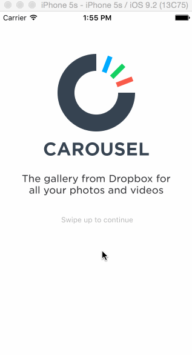

# Week 2 - week2-Carousel

week2-Carousel is a prototype of the Carousel application.

Submitted by: Vishay Nihalani

Time spent: 8 hours. Fixing warnings took the longest. Both were due to creating modals on buttons instead of view controllers.

## User Stories

The following **required** functionality is complete:
* [x] All of the required features are implemented

The following **optional** features are implemented:
[ ] Photo tiles move with scrolling
[x] When the keyboard is visible, if the user pulls down on the scrollview, it will dismiss the keyboard.
[ ] On appear, scale the form up and fade it in.
[ ] Create a Dropbox
[ ] Tapping in the form reveals the keyboard and shifts the scrollview and "Create a Dropbox" button up.
[ ] Tapping the Agree to Terms checkbox selects the checkbox.
[ ] Tapping on Terms shows a webview with the terms.
[ ] User is taken to the tutorial screens upon tapping the "Create a Dropbox" button.
[x] User can page between the screens with updated dots
[x] Upon reaching the 4th page, hide the dots and show the "Take Carousel for a Spin" button.
[ ] Learn more about Carousel
[ ] Show the "Learn more about Carousel" button in the photo timeline.
[ ] Tap the X to dismiss the banner
[ ] Track the 3 events
[ ] Upon completion of the events, mark them green.
[ ] When all events are completed, dismiss the banner.

The following **additional** features are implemented:
- [ ] List anything else that you can get done to improve the app functionality!

## Video Walkthrough

Here's a walkthrough of implemented user stories:

GIF created with [LiceCap](http://www.cockos.com/licecap/).

## Notes

Spent some time debugging warnings, and forgot that you can add manual modals to view controllers, rather than buttons.

## License

Copyright 2016 Vishay Nihalani

Licensed under the Apache License, Version 2.0 (the "License");
you may not use this file except in compliance with the License.
You may obtain a copy of the License at

http://www.apache.org/licenses/LICENSE-2.0

Unless required by applicable law or agreed to in writing, software
distributed under the License is distributed on an "AS IS" BASIS,
WITHOUT WARRANTIES OR CONDITIONS OF ANY KIND, either express or implied.
See the License for the specific language governing permissions and
limitations under the License.
